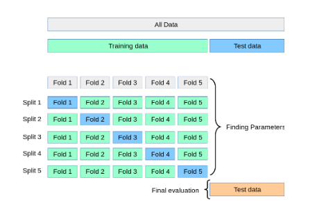

# ITO5201 - Assessment 1

## Objectives

This assessment assesses your understanding of:

1. Model complexity and model selection
2. Probability
3. Ridge regression
4. Logistic Regression versus Bayes Classifier.

## 1 Model Complexity and Model Selection

In this section, you study the effect of model complexity on the training and testing error. You also demonstrate your programming skills by developing a regression algorithm and a cross-validation technique that will be used to select the models with the most effective complexity.

### Background

A KNN regressor is similar to a KNN classifier (covered in Activity 1.1) in that it finds the K nearest neighbors and estimates the value of the given test point based on the values of its neighbours. The main difference between KNN regression and KNN classification is that a KNN classifier returns the label that has the majority vote in the neighborhood, whilst KNN regressor returns the average of the neighbors’ values. In Activity 1 of Module 1, we use the number of misclassifications as the measurement of training and testing errors in a KNN classifier. For KNN regressor, you need to choose another error function (e.g., the sum of the squares of the errors) as the measurement of training errors and testing errors.

### Question 1 [KNN Regressor, 5+5=10 Marks]

**I** Implement a KNN regressor using the scikit-learn conventations, i.e., in a class with the following skeleton.

``` python
from sklearn.base import BaseEstimator
class KnnRegressor(BaseEstimator):
    def __init__(self): # ADD PARAMETERS AS REQUIRED
        # YOUR CODE HERE
    def fit(self, x, y): 
        # YOUR CODE HERE     
        return self          
    def predict(self, x): 
        # YOUR CODE HERE
```

Hint: You can closely follow the implementation from Activity1.1 of the KNN classifier. You cannot `use sklearn.neighbors.KNeighborsRegressor` to solve this task.

**Note**: Inheriting from `BaseEstimator` is not strictly required, but allows to use the implementation with utility functions like `sklearn.model_selection.cross validate`.

**II** To test your implementation, load the datasets `diabetes` and `california housing` through the functions `load_diabetes` and `fetch_california_housing`, both of which are available in the module sklearn.datasets. For both datasets, perform a training/test split (using a fraction of 0.6 of the data as training data), fit your KNN regressor to the training portion (using some guess for a good value of k), and report the training and test errors.

### Question 2 [L-fold Cross Validation, 5+5+5=15 Marks]

**I** Implement a L-Fold Cross Validation (CV) scheme using the scikit-learn convention for datasplitters, i.e., using the following skeleton. 
Note that this is usually referred to as K-fold cross-validation. We are simply using the symbol L here to differentiate the cross validation parameter from the number of neighbours in K-nearest neighbours.

```python
class LFold:
    def __init__(self):# ADD PARAMETERS AS REQUIRED
        # YOUR CODE HERE
    def get_n_splits(self, x=None, y=None, groups=None):
        # YOUR CODE HERE
    def split(self, x, y=None, groups=None):
        # YOUR CODE HERE
        yield train_idx, test_idx
```

Hint: As usual, there are many ways to implement the desired solution. For one of the ways, the function np.concatenate can be useful to build up the array if the train indices. Test your implementation for correctness by running a simple example like the following.

```python
    for idx_train, idx_test in LFold(5).split(list(range(20))):
        print(idx_train, idx_test)
```

You cannot use `sklearn.model_selection.KFold` to solve this task.

**II** For both datasets from Question1, use your L-fold CV implementation to systematically test the effect of the KNN parameter K by testing all options from 1 to 50 and,for each K,instead of only performing a single training/test split run your L-Fold CV. For each K compute the mean and standard deviation of the mean squared error (training and test) across the L folds and report the K for which you found the best test performance (for both datasets).

_Hint_: To avoid code duplication and name clashes, consider creating a function or class that, given some generic input dataset, encapsulates the experiment of performing the cross validation for each candidate K and stores/returns the results in an appropriate data structure.

**III** For both datasets, plot the mean training and test errors against the choice of K with error bars (using the standard error of the mean). You can compute the standard error of the means as:

```math
ste = 1.96s/√L
```

where s is the sample standard deviation of the error across the L folds. Based on this plot, comment on

* The effect of the parameter K. For both datasets, identify regions of overfitting and underfitting for the KNN model.
* The effect of the parameter L of the CV procedure. HINT: You might want to repeat the above process with different values for L to get an intuition of its effect.

Hint: Think about what values for K make the model more or less flexible. Again, it might be useful to create a function for plotting to avoid code duplication and name clashes.

### Question 3 [Automatic Model Selection, 5 + 5 = 10 Marks]

**I** Implement a version of the KNN regressor that automatically chooses an appropriate value of K from a list of options by performing an internal cross-validation on the training set at fitting time. As usually, use the scikit-learn paradigm, i.e., use the following template.

```python
from sklearn.base import BaseEstimator

class KnnRegressorCV(BaseEstimator):
    def __init__(self, ks=list(range(1, 21)), cv=LFold(5)):

```



Figure 1: Illustration of data use for Question 3.II with a simple train/test split (and the “inner” cross validation performed on the training data by KnnRegressorCV). A better test would replace the training/test split with an additional “outer” cross validation to check multiple times what K has been selected. This scheme would be called a nested cross validation. See [https://scikit-learn.org/stable/modules/cross_validation.html]

```python
# YOUR CODE HERE
    def fit(self, x, y):
        # YOUR CODE HERE
        self.k_ = # YOUR CODE HERE
        return self
    def predict(self, | x):
        # YOUR CODE HERE
```

_Hint_: You might want to store the optimal value for K that has been determined by the internal cross-validation (as indicated in template) for ease of access in the next step. 
Also you can again use inheritance from `BaseEstimator` to allow usage of cross validate in the next step.

**II** For both datasets from the previous questions, test your KNN regressor with internal CV by using either an _outer_ single train/test-splitor, ideally, with an _outer_ cross-validation (resulting in a so-called nested cross-validation scheme). See Fig. 1 for a further explanations. Report on the (mean) k value that is chosen by the KNN regressor with internal cross validation and whether it corresponds to the best k-value with respect to the outer test sets. Comment on what factors determine whether the internal cross-validation procedure is successful in approximately selecting the best model.

## Probability

In this section you show your knowledge about the basics of probability theory by solving simple but basic probabilistic modelling and inference problems. Solve the problems based on the probability concepts you have learned in Modules 1 and 2.

### Question 4 [Bayes Rule, 5+5=10 Marks]

Suppose we have one red, one blue, and one yellow box with the following content:

* in the red box we have 3 apples and 5 oranges,
* in the blue box we have 4 apples and 4 oranges, and
* in the yellow box we have 1 apples and 1 orange.

Now suppose we selected one of the boxes uniformly at random and then, in a second step, picked a fruit from it, again uniformly at random.

**I** Implement a Python function that simulates the above experiment (using a suitable method of a numpy random number generator obtained via numpy.random.get default rng). For instance you could name the function and it could take a parameter for `fruit experiment` the number

```python
    array([’red’, blue’, ’blue’, ’yellow’], dtype=’object’),
    array([’orange’, ’orange’, ’apple’, ’apple’, dtype=’object’))
```

_Hint_: Depending on your implementation, the method integers of the random number generator could be useful.

**II** Answer the following question by a formal derivation in a markdown cell (ideally using Latex for clean type setting): If the picked fruit is an apple,what is the probability that it was picked from the yellow box?

_Hint_: Formalise this problem using the notions in the “Random Variable” paragraph in
Appendix A of Module 1. You might want to use your simulation function from Part I to check your answer.

### Question 5 [Expected Values, 5+5+5=15 Marks]

Consider the following simple one-player game: the player first rolls a fair six-sided die and then she determines her score as the sum of the
outcomes of a number of aadditional die roles, where the number of additionally rolled dice is equal to the number rolled with the first die. Formally, we can describe this game with a set of random variables:

* X, the outcome of the first die roll
* Y(i) for i=1,...6, the outcome of the i-th subsequent die role if i≤X or 0 otherwise.
* Z=Y(1) + Y(2) +Y(3) + Y(4) +Y(5) +Y(6) the final score of the player.

We are interested in experimentally and analytically determining the score that a player can expect to achieve in this game on average, i.e., the expected value E[Z].

**I** Implement a Python function die experiment that simulates the above game for a desired number of repetitions and returns the array of scores achieved by the player for each repetition.

**II** Estimate the expected player score E[Z] by performing 10,000 repetitions and provide an error margin of this estimate with 95% certainty.

**III** Analytically derive the expected value E[Z] in a markdown cell (using Latex formulae for clean typesetting).

_Hint_: Determine first the conditional expectation E[Z|X = x] given a specific value of x for X. Then use the rule that the marginal expectation E[Z] can be computed as the average of E[Z|X =x] over all possible values x weighted by their probability (this is the ”rule of total expectation” as used in the analysis for the bias/variance trade-off).

## 3 Ridge Regression

In this section, you develop Ridge Regression by adding the L2 norm regularization to the linear regression (covered in Activity 2.1 of Module 2) and study the effect of the L2 norm regularization on the training and testing errors. This section assesses your mathematical skills (derivation), programming, and analytical skills.

### Question 6 [Ridge Regression, 10+5+5=20 Marks]

**I** Derive the weight update steps of stochastic gradient descent (SGD) for linear regression with L2 regularisation norm or a system of linear equations that uniquely determine the minimum of the regularised error function. Give this derivation with enough explanation in a markdown cell (ideally using Latex for readable math typesetting). The starting point is the definition of the regularised error function and the end result is either the weight update step for this function in (stochastic) gradient descent or a system of linear equations described in matrix/vector notation. In both cases, you have to derive the gradient as an intermediate step.

_Hint_: Recall that for linear regression we defined the error function E. For this assignment, you only need to add an L2 regularization term to the error function (error term plus the regularization term). This question is similar to Activity 2.1 of Module 2.

**II** Using the analytically derived gradient from StepI, implement either a direct or a(stochastic)gradient descent algorithm for Ridge Regression - use again the usual template with `__init__` , `fit`, and `predict methods.

You cannot use any import from `sklearn.linear` model for this task.

**III** Study the effect of the L2-regularization on the training and testing errors,using the synthetic data generator from Activity 2.3. i.e., where data is generated according to 

```math
    X∼Uniform(−0.3,0.3)

    Y = [(sin(5πx)) / (1 + 2x)] + ϵ

    ϵ∼N(0,0.1)
```

1. Consider the ridge regression model for each λ in {10^(−10+9i/100),...,10^−1:0≤i≤100} by creating a pipeline of your implemented ridge regressor with a polynomial feature
transformer with degree 5.

_Hint_: You can create an array with the above choices for λ via `numpy.geomspace(10**-10, 0.1, 101, endpoint=True)`

2. Fit each model at least ten times (resampling a training dataset of size 20 each time) for all choices of λ. To reduce the variance of the experiment make sure that for each repetition all models use the same training dataset (i.e., make the repetitions the outer loop and the choices of λ the inner loop, and sample only one training set per outer loop).

3. Create a plot of mean squared errors (use different colors for the training and testing errors), wherethex-axisisloglambdaandy-axisisthelogmeansquarederror. Discuss λ, model complexity, and error rates, corresponding to underfitting and overfitting, by observing your plot.

_Hint_: For log-scaling an axis you can use, e.g.,pyplot.x scale(’log’). Moreover, note that, as we have a synthetic data source here, you can simply sample a large amount of independent test data and re-use that to approximate the generalisation error for all fits.

## 4 Logistic Regression versus Bayes Classifier

| ---------- | ---------- | ----------------- | ------- | --- | --- | --- |
This task assesses your analytical skills. You need to study the performance of two well-known generative and probabilistic models, i.e. Bayesian classifier and logistic regression, as the size of the training set increases. Then, you show your understanding of the behavior of learning curves of typical generative and probabilistic models.

### Question 7 [Discriminative vs Generative Models, 5+5+5+5=20 Marks]

**I** Load the breast cancer dataset via load breast cancer in sklearn.datasets, import `LogisticRegression` from `sklearn.linear_model`, and copy the code from Activity 3.3. for the Bayes classifier (BC). For the Bayes classifier consider the Naive Bayes variant (with-out shared covariance) as well as the variants with full covariance (shared and not shared).
Perform a training/test split (with train size equal to 0.8) and report which of the models performs best in terms of train and test performance.

_Note_: for logistic regression you can also use the code for the variant with regularisation from Activity 3.2, but this option requires a more careful calibration of the classifier parameters (batch size, max iterations and error tolerance).

**II** Implement an experiment where you test the performance for increasing training sizes of N = 5,10,...,500. For each N sample 10 training sets of the corresponding size, fit all
models, and record training and test errors.

_Hints_: You can use training test split from `sklearn.model_selection` with an integer parameter for train size (do not forget to use shuffle=True). Again make the repetitions the inner loop to assure that all models are trained on the same training set for a given repetition and sample size.

**III** Create suitable plots that compare the mean train and test performances of all models as a function of training size. There is no need to include error bars if that makes the plot too hard to read.

**IV** Formulate answers to the following questions:

1. What happens to each classifiers train and test performance when the number of training data points is increased?

2. Which classifier is best suited when the training set is small, and which is best suited when the training set is big?

3. Justify your observations by providing some speculations and possible reasons.

_Hint_: Think about model complexity and the fundamental concepts of machine learning covered in Module 1. In particular think of the number of parameters that each model has to learn and what assumptions the models make about the data which could be violated.